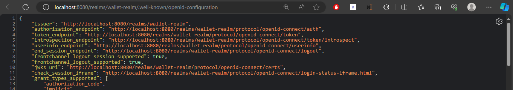
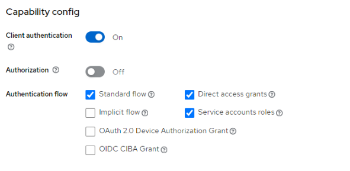

# Hands_in_Keycloack

Keycloak is an open-source Identity and Access Management (IAM) solution that helps you secure your applications and services. It provides features such as single sign-on (SSO), authentication, authorization, and user management.

# Download and Install Keycloak
 Before you start with Keycloak, ensure that you have OpenJDK 17 installed on your system.
 Visit the [Keycloak download page](https://www.keycloak.org/downloads.html) and download the latest version of Keycloak. Choose the distribution that suits your environment, such as standalone server, Docker image, or JBoss WildFly.
1. Extract the downloaded ZIP file.
2. Navigate to the extracted directory.
3. Run Keycloak using the following command:

    ```bash
    bin/kc.bat start-dev
    ```
    Once Keycloak is running, access the Admin Console at [http://localhost:8080/auth/admin](http://localhost:8080/auth/admin)

    # Set up an admin user
   Keycloak has no default admin user. You need to create an admin user before you can start Keycloak.
   - The first time you access the Admin Console, create an admin user.
   - Click on "Administration Console" and follow the prompts to set up the admin user.

  
  
  1. Log in with the username and password you created during the initial Keycloak setup.

   - **Username:** Enter the admin username you created.
   - **Password:** Enter the admin password.

2. Click "Login" to access the Keycloak Admin Console.
   
   

  # Create a Realm
  - A realm in Keycloak is a space where your applications and services exist.
  - After logging in, click "Add Realm" on the left sidebar to create a new realm.
    


# Add a Client
- A client in Keycloak represents an application that will use Keycloak for authentication.
- In your realm, click on "Clients" in the left sidebar and then click "Create".
- Configure the client settings, such as the client ID and client protocol.


# Create a User in Keycloak and Set Initial Password

1. Navigate to the "Users" section in the left-hand menu of the Keycloak Admin Console.

2. Click on the "Add user" button.

3. Fill in the required information in the form:

    - **Username:** Enter a unique username for the user.
    - **Email:** Provide the user's email address.
    - **First Name and Last Name:** Enter the user's first and last names, if applicable.

4. Click the "Create" button to create the user.

5. To set the initial password:

    - Click on the "Credentials" tab at the top of the page.

    - Fill in the "Set password" form with a secure password.

    - Toggle the "Temporary" switch to "Off" so that the user does not need to update this password at the first login.

6. Click "Save" to apply the changes.

Now, the user has been created, and an initial password has been set. The user can use these credentials to log in, and there is no requirement to update the password at the first login.
createUser


This is the list of users i have created:


# Create Realm Roles in Keycloak

1. Navigate to the "Realm roles" section in the left-hand menu of the Keycloak Admin Console.

2. Click on the "Add role" button.

3. Fill in the required information in the form:

    - **Role Name:** Enter a unique name for the role.

4. Click the "Save" button to create the role.


### Assign a Role to a User in Keycloak

1. In the Keycloak Admin Console, navigate to the "Users" section.

2. Click on the user for whom you want to assign a role.

3. In the user details view, click on the "Role Mappings" tab.

4. Under the "Realm Roles" or "Client Roles" section, locate the role you want to assign.

5. Click the "Assign Role" button.

6. Click "Assign" to confirm the role assignment.


# Realm settings

- Endpoints


- OpenID Endpoint Configuration

  
  
# Get Token
### Get Token with Grant Type Password
To get a token in the first time with ``grant_type = password``

``http://localhost:8080/realms/wallet-realm/protocol/openid-connect/token``

Include the necessary parameters:

```json
{
  "grant_type": "password",
  "client_id": "your-client-id",
  "client_secret": "your-client-secret",
  "username": "user-username",
  "password": "user-password"
}

```


### Decode JWT token.
To decode JWT token past the access_token in jwt.io :


### Get Token with Grant Type Refresh Token
1. Active the client authentication



2. Get client secret

 

3. Include the necessary parameters

```json
{
  "grant_type": "refresh_token",
  "client_id": "your-client-id",
  "client_secret": "your-client-secret",
  "refresh_token": "your-refresh-token"
}
```

As always, replace placeholders such as `"your-client-id"`, `"your-client-secret"`, and `"your-refresh-token"` with your actual values.

 

### Get Token with Grant Type Client Credentials

 


